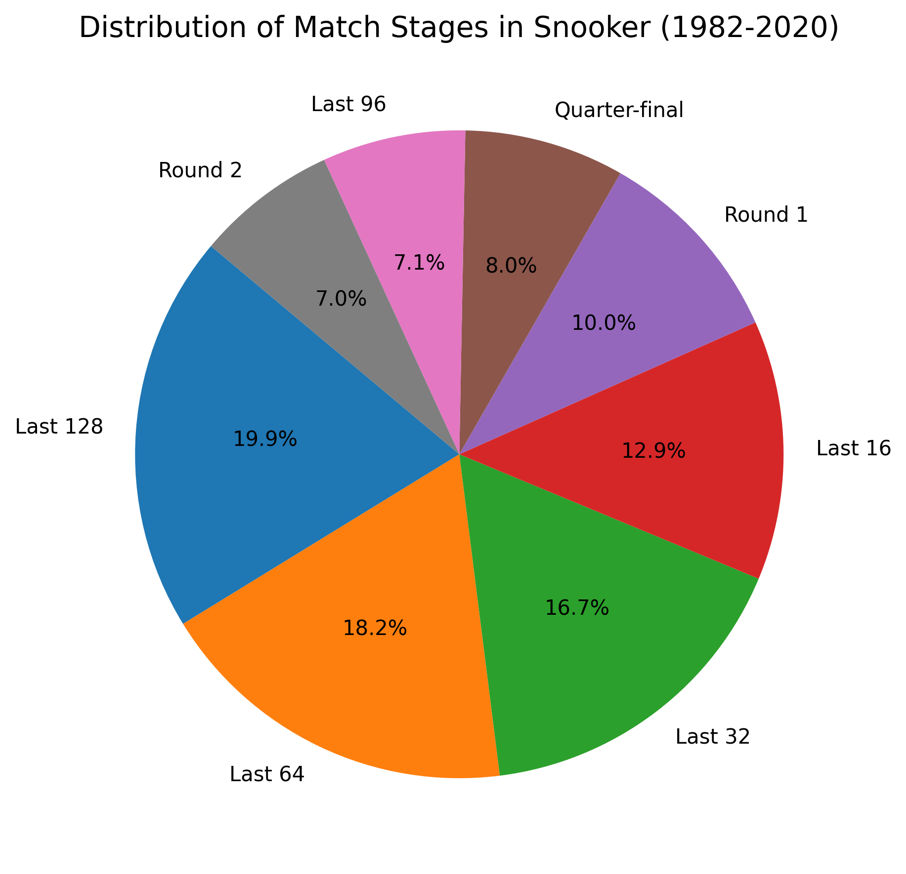
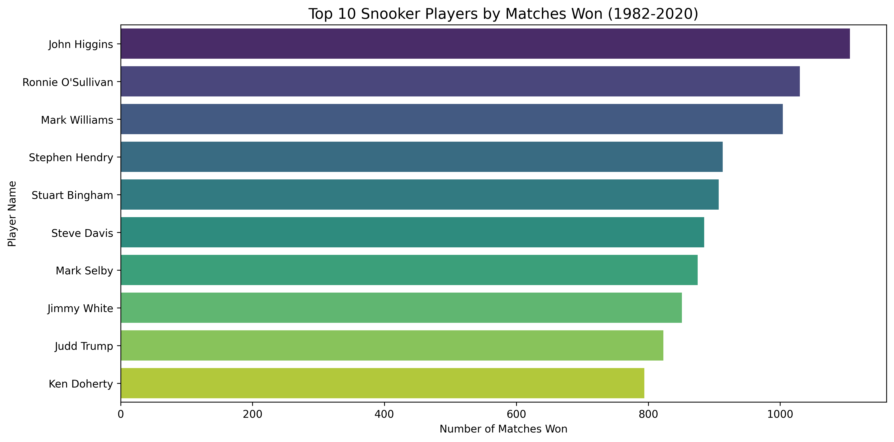

# 🎱 Snooker EDA Analysis


---

# 📌 Project Overview

This project presents an **Exploratory Data Analysis (EDA)** of the **Snooker Matches Dataset (1982–2020)** using Python.

The analysis focuses on understanding player performance, tournament stages, and match statistics through data visualization and descriptive analysis.

---

# 📂 Dataset

- **Dataset:** Snooker Matches (1982–2020)
- **File Format:** CSV
- **Analysis Tool:** Google Colab / Jupyter Notebook

---

# 🛠 Technologies Used

- Python
- Pandas
- NumPy
- Matplotlib
- Seaborn
- Google Colab

---

# 📊 Analysis Performed

✔ Data Cleaning

✔ Missing Value Analysis

✔ Match Stage Distribution

✔ Top 10 Players by Matches Won

✔ Data Visualization

---

# 📈 Visualizations

## 1️⃣ Distribution of Match Stages



---

## 2️⃣ Top 10 Snooker Players by Matches Won



---

# 📁 Repository Structure

```
Snooker-EDA-Analysis
│
├── README.md
├── LICENSE
├── Snooker_EDA.ipynb
├── Snooker_EDA_Report.pdf
├── Stage_Distribution.png
└── Top10_Players.png
```

---

# 🚀 How to Run

### Clone the repository

```bash
git clone https://github.com/ramishswati/Snooker-EDA-Analysis.git
```

### Install libraries

```bash
pip install pandas numpy matplotlib seaborn
```

### Run Notebook

Open

```
Snooker_EDA.ipynb
```

using **Google Colab** or **Jupyter Notebook** and run all cells.

---

# 📌 Key Insights

- Early tournament stages contain the highest number of matches.
- John Higgins recorded the highest number of match victories.
- Ronnie O'Sullivan and Mark Williams are among the most successful players.
- The dataset covers nearly four decades of professional snooker history.

---

# 📄 Report

The detailed project report is available in:

```
Snooker_EDA_Report.pdf
```

---

# 👨‍💻 Author

**Ramish Khan**

GitHub:
https://github.com/ramishswati

---

⭐ If you like this project, consider giving it a Star.
